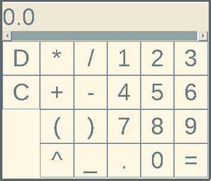
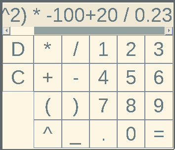

# Java Calculator
A simple calculator capable of evaluating infix, postfix and prefix expressions.
For now, '^', '*', '/', '+', '-' are supported. Additionally, '(' and ')' are valid in infix notation.
## Building
```bash
git clone https://github.com/OdinPreston/java-calculator.git
cd java-calculator
javac *.java
```
At this point you have two options. You can run the program using `java JavaCalculator ARGS` where `ARGS` are command line arguments. Or you can also:
### Create a .jar file
```bash
jar cvfe JavaCalculator.jar JavaCalculator *.class
```
You can then put JavaCalculator.jar in place of your choice, and run it with `java -jar /path/to/JavaCalculator.jar`. For convenience you can create a script file to launch it akin to a binary, like:
```bash
echo '#!/path/to/java -jar' > JavaCalculator
cat JavaCalculator.jar >> JavaCalculator
chmod +x JavaCalculator
```
Where `/path/to/java` is the absolute path to java executable.
Then you can use JavaCalculator to launch the program, as any other binary (even though it's not a binary).
## Usage
### Command line
For command line usage, run with command-line arguments, where each argument is a single expression in any of the supported notations. For example:
`JavaCalculator "2+2*50" "* / 9 3 20" "20 6 4 + *"`
will produce
```
2+2*50: Infix Notation.
102.0
* / 9 3 20: Prefix Notation.
60.0
20 6 4 + *: Postfix Notation.
200.0
```
### GUI
There is also GUI, accessible if you run the program without any command line arguments. The images of how it looks like are below. It has the added benefit of being able to copy the output at any given time, by clicking the number display with left mouse button.
#### Keybindings
Key | Action
----|-------
D, d	  | Backspace
C, d   	  | Clear display
X, x   	  | Copy expression to clipboard
Q, q   	  | Quit program
ESC    	  | Quit program
`=`    	  | Evaluate expression
`^`    	  | Insert `^` into expression
`*`    	  | Insert `*` into expression
`/`    	  | Insert `/` into expression
`+`    	  | Insert `+` into expression
`-`    	  | Insert `-` into expression
`.`    	  | Insert `.` into expression
`(`    	  | Insert `(` into expression
`)`    	  | Insert `)` into expression
SPACE  	  | Insert a blank into expression
BACKSPACE | Backspace
ENTER  	  | Evaluate expression
0-9    	  | Insert a number into expression
L Arrow	  | Scroll display left
R Arrow	  | Scroll display right
#### Images


## Todo
1. [x] ~~Add the exponent (^) operator.~~ 
2. [x] ~~Use BigDecimal instead of double.~~
3. [x] ~~Make a simple GUI interface launchable when ran with no arguments.~~
4. [x] ~~Add support for negative numbers.~~
5. [x] ~~Make the number displayed in GUI copyable to clipboard by clicking.~~
6. [x] ~~Configure GUI to take input from keyboard as well.~~
## License
This program is free software: you can redistribute it and/or modify
it under the terms of the GNU Affero General Public License version 3 only
as published by the Free Software Foundation.

